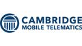

Boston Python would not be able to put on the events that we do without the help
of our sponsors and event hosts.  Our sponsors provide us with donations to pay
for refreshments at in-person events and other expenses, and our event hosts
provide space for us to meet. Below we list some of the many organizations that
have supported us over the last two decades.

## Current Sponsors

||[CarGurus](https://www.cargurus.com/) is a regular host and sponsor|
||The Microsoft NERD Center is a long-time regular event host|
| | [DataDog](https://www.datadoghq.com/) is a regular event host and sponsor|

## Past Sponsors
| | [Planet Technology](https://planet-technology.com/)|
| | [Vinta](https://www.vinta.com.br/) |
| | [Cambridge Mobile Telematics](https://www.cmtelematics.com/)|
||[Temporal](https://temporal.io/)|

If you would like to see your organization listed here, visit our
[sponsorship page](sponsorship.md) or [hosting page](hosting.md) to learn more
about sponsorship and hosting.
